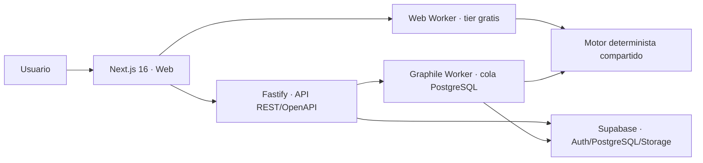

# ADR-001 — Arquitectura de la beta inicial

Estado: aceptada e implementada parcialmente  
Fecha: 2026-07-27

## Decisión

La beta se implementa como monorepo TypeScript con un monolito modular y dos procesos desplegables: API y worker. La aplicación web usa el mismo motor de dominio dentro de un Web Worker para el tier gratuito; el tier pago ejecutará corridas mediante Graphile Worker y PostgreSQL.

## Reglas que condicionan la solución

- Los `numeric` cruzan API y archivos como cadenas decimales; el motor usa `decimal.js` y prohíbe cálculos monetarios con `number`.
- El tier gratuito no conserva borradores ni datos empresariales en servidor. La continuidad se realiza con un ZIP local versionado, validado por hash y recalculado al importar.
- El motor no redondea antes de conciliar. Dos decimales pertenecen exclusivamente a presentación.
- Cada corrida paga posee versiones, snapshot canónico por sección, hashes y resultados normalizados por catálogo de métricas.
- Toda tabla empresarial incluye `empresa_id`; las FKs compuestas y RLS impiden referencias cruzadas entre tenants.
- Una corrida cerrada, sus snapshots, resultados y auditoría son inmutables.

## Mapeos reconciliados con el diccionario

| Contrato lógico | Implementación beta | Motivo |
|---|---|---|
| `auth.usuario` | `auth.users` + `core.usuario_perfil` | Supabase administra credenciales; no se duplica `password_hash`. |
| `auth.usuario_empresa` | `core.usuario_empresa` | Se evita modificar el schema reservado `auth` de Supabase. |
| `auth.plan` / `auth.plan_limite` | `billing.plan` / `billing.plan_limite` | El plan es facturación/autorización comercial, no identidad. |
| `numeric(24,8/10)` | `string` en DTO + `Decimal` en dominio + `numeric` en PostgreSQL | Conserva precisión de punta a punta. |
| resultados lógicos | `calc.catalogo_metrica` + `calc.resultado_metrica` | Evita columnas ad hoc por fórmula. |

Todo alias conserva `snake_case`, tiene migración explícita y debe cubrirse con pruebas de contrato.

## Alcance del primer migration

Se materializan únicamente las entidades necesarias para identidad administrada, tenant, ítems, BOM, períodos, corridas, versiones, snapshots, métricas, conciliación, jobs y auditoría. Las restantes entidades del modelo de 98 tablas se incorporarán por cortes verticales; crear tablas sin caso de uso ejecutable queda fuera de esta beta.

## Despliegue

- Supabase en `sa-east-1` para Auth, PostgreSQL y Storage.
- Fly.io `gru` para web, API y worker.
- Node.js 24 LTS y contenedores separados a partir de un Dockerfile multi-stage.
- La API y el worker usan `DATABASE_URL` como secreto. El navegador solo recibe claves públicas de Supabase cuando se habilite el flujo autenticado.

Los nombres `app` de los TOML son placeholders y deben sustituirse por nombres disponibles antes del primer `fly deploy`.
